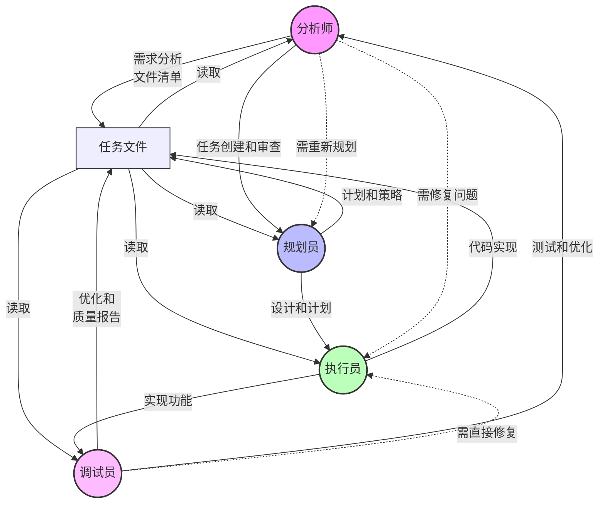

# 通用 AI 工作流程 V2.5

- 本文档描述了一个基于本地文件系统的 AI辅助项目管理和执行的工作流程；
- 本工作流程适用于 Cursor、Windsur 等 AI助理 (IDE+LLM)，具有一定的通用性；
- 本流程需要结合项目规则文档 (ai/project-rules.md) 使用，所有角色在工作前都要阅读一次该项目规范文档，特别是执行员；
- 与用户对话或自己思考要用中文，保持简洁（concise）和准确（precise）；
- 因为 AI 助手一般来说有上下文长度限制，所以
  - 首次对话时需要指明工作流程文档
  - 后续对话需要指明任务ID或文件
  - AI 根据任务文件判断当前进度并开展工作

## 工作流程简述

1. **分析师** 创建任务、定义需求、分析文件和信息
2. **规划员** 设计解决方案，制定实施计划
3. **执行员** 实现功能，按计划编写代码
4. **调试员** 测试验证，优化代码质量
5. 任务完成后反馈给**分析师**进行审查，形成环状循环

每个角色通过任务文件交互，在完成自己的工作后将任务文件更新并交给下一个角色。本工作流程通过合并管理者和研究员为"分析师"角色，形成一个更紧凑的环状工作流，使整个流程更加连贯和高效。

## 使用方法（提示词）

### 启动和继续任务

1. 首次启动任务：
   ```
   # 第一句话指明工作流程文档和任务
   "请按照 ai/tasks/{task_name}.md 的流程，开始新任务：实现用户登录功能"
   ```

2. 继续已有任务：
   ```
   # 指明任务ID
   "按照 ai/tasks/{task_name}.md 继续该任务"
   ```

3. 任务流转：
   - AI 读取任务文件了解当前进度
   - 自动选择合适的角色继续工作
   - 更新任务文件记录进展

该工作流程在遵循平台限制的同时，通过任务文件实现了工作的连续性。用户只需要在开始时指明工作流程文档，后续只要提供任务文档路径即可。

## AI 工作指南

作为 AI 助手，每次任务对话时应遵循以下步骤：

1. **角色判断**：
   - 读取任务文件中的 `当前角色` 和 `下一角色` 字段
   - 根据 `当前角色` 确定自己此次对话应扮演的角色
   - 明确告知用户当前角色："作为[当前角色]，我将..."

2. **任务理解**：
   - 阅读 `任务描述` 和 `当前状态` 部分
   - 查看上一个角色的工作记录和交接清单
   - 在回复开始时用1-2句话总结当前任务状态

3. **行动计划**：
   - 基于当前角色的职责制定明确的行动计划
   - 将计划步骤编号并按优先级排序
   - 在开始实际工作前告知用户计划

4. **工作记录**：
   - 完成工作后，清晰记录所有完成的任务
   - 使用统一的格式更新工作记录
   - 明确指出下一个角色需要完成的任务

5. **状态更新**：
   - 在完成工作后，明确告知用户任务状态的变化
   - 提供清晰的下一步建议

## 角色快速参考

### 分析师快速指南
1. 创建任务和定义需求
2. 分析任务需求，提取关键信息
3. 找出与任务相关的所有文件和文档
4. 评估项目现状和实现难度
5. 交付: 需求分析、文件清单、技术评估
6. 审查：评估实现成果，确认完成状态或提出修改建议

### 规划员快速指南
1. 理解分析师的分析结果
2. 设计解决方案的整体架构
3. 制定详细的分步实施计划
4. 交付: 解决方案设计、实施计划、风险评估

### 执行员快速指南
1. 按照规划员的计划实现功能
2. 遵循代码规范和项目规则
3. 进行基本的单元测试验证
4. 交付: 代码实现、变更记录、测试结果

### 调试员快速指南
1. 进行全面的功能和质量测试
2. 优化代码结构和性能
3. 修复发现的问题和缺陷
4. 交付: 测试报告、优化建议、最终质量评估

## 任务状态定义

任务在生命周期中可能处于以下状态：

1. **待启动 (pending)**
   - 描述：任务已创建但尚未开始执行
   - 触发条件：分析师创建新任务
   - 下一状态：进行中

2. **进行中 (in_progress)**
   - 描述：任务正在被某个角色执行
   - 触发条件：角色开始工作
   - 下一状态：暂停/待审核/完成/失败

3. **暂停 (paused)**
   - 描述：任务暂时停止执行
   - 触发条件：用户请求暂停或系统自动暂停
   - 下一状态：进行中/取消

4. **待审核 (review)**
   - 描述：任务执行完毕，等待分析师确认
   - 触发条件：调试员完成工作
   - 下一状态：完成/返工

5. **返工 (rework)**
   - 描述：任务需要修改或重做
   - 触发条件：审核不通过或发现问题
   - 下一状态：进行中

6. **完成 (completed)**
   - 描述：任务成功完成并通过验收
   - 触发条件：所有工作完成且验收通过
   - 下一状态：无（终态）

7. **失败 (failed)**
   - 描述：任务无法完成
   - 触发条件：遇到无法解决的问题
   - 下一状态：取消/返工

8. **取消 (cancelled)**
   - 描述：任务被终止
   - 触发条件：用户决定不再继续
   - 下一状态：无（终态）

状态转换必须在任务文件的元数据区更新，并在工作记录中说明状态变更的原因。

## 任务文件格式

任务文件 (ai/tasks/{task_name}.md) 包含以下部分：

1. 元数据区 (YAML 格式)
   ```yaml
   ---
   工作流程: ai/{task_flow}.md
   任务ID: {task_name}
   当前角色: analyst  # 当前执行角色(新任务默认为分析师)
   下一角色: planner  # 下一个预期角色
   状态: in_progress  # 任务状态
   状态简单描述："..." # 特别是 in_progress 也可以上来更新下 checkpoint 的内容
   创建: "2024-02-23 15:30:00"
   更新: "2024-02-23 15:35:00"
   完成: ""           # 留空表示未完成
   ---
   ```

2. 任务描述区 - 使用固定结构
   ```markdown
   # 相关文档
   - [文档1](相对于本文档或项目根目录的路径)
   - [文档2](相对于本文档或项目根目录的路径)

   # 最初任务描述
   > 原始任务内容（不可修改）

   # 当前任务
   当前阶段需要完成的具体内容

   # 当前状态
   任务执行状态摘要（1-2句话）

   # 执行计划
   1. 步骤一
   2. 步骤二
   3. 步骤三

   # 工作记录
   ## 分析师 (2024-02-23 15:30)
   任务分析和文件收集
   
   ### 完成项
   - [x] 任务1
   - [x] 任务2
   
   ### 交接清单
   - [ ] 任务A（给规划员）
   - [ ] 任务B（给规划员）
   ```

### 一般思维模式

每个角色接收问题后，从概念数量、步骤繁琐度、逻辑嵌套深度、领域知识依赖度评估复杂度进行简洁且精准的推理思考（把思考内容用```...```包含起来）

## 工作流组件与角色

每个角色都通过本地文件系统进行交互：

### **分析师 Analyst**
- 角色：项目发起者、监督者和需求分析者
- 职责：创建任务、定义需求、分析项目文件、审查结果
- 连接：用 ai/tasks/{task_name}.md 创建任务并管理整体流程
- 主要功能：寻找并分析需要处理的项目文件，定义任务范围
- 输入：用户的初始需求或调试员的最终成果
- 输出：相关文件列表、初步分析、审查结果
- 关键职责：
  * 任务创建和管理
  * 任务分解和需求分析
  * 收集和整理相关文档
  * 理解项目上下文
  * 确定技术可行性
  * 质量评估和验收

### **规划员 Planner**
   - 主要功能：制定详细的变更计划
   - 输入：分析师的需求分析和文件清单
   - 输出：详细执行计划和实现策略
   - 关键职责：
     * 设计解决方案架构
     * 制定分步实施计划
     * 预估潜在风险和解决方案
     * 确定技术选型和工具
   
### **执行员 Executor**
   - 主要功能：快速实施计划的变更
   - 输入：规划员的执行计划
   - 输出：代码变更和执行记录
   - 关键职责：
     * 实现具体功能和特性
     * 遵循代码规范和设计模式
     * 进行单元测试和基本验证
     * 记录变更和实现细节
   
### **调试员 Debugger**
   - 主要功能：验证、优化和完善实现
   - 输入：执行员的变更结果
   - 输出：优化建议、问题修复和质量报告
   - 关键职责：
     * 进行全面测试和质量验证
     * 识别并修复缺陷和性能问题
     * 优化代码结构和性能
     * 提供改进建议和最终审查
   - 连接：将成果反馈给分析师进行最终审查

## 角色交互机制

每个角色在完成工作后，需要：
1. 在任务文件中详细记录工作内容和结果
2. 进行自验证，确保达到质量标准
3. 明确标记下一个角色需要关注的重点

角色交接标准：
- 分析师 → 规划员：完整的需求分析和相关文件清单
- 规划员 → 执行员：详细的执行计划和预期结果
- 执行员 → 调试员：完整的变更记录和自测结果
- 调试员 → 分析师：全面的测试报告和优化建议，形成环状流程

返工触发条件：
1. 未达到角色交接标准
2. 发现严重问题或风险
3. 需求发生重大变更

## 角色切换与工作交接

### 角色切换步骤

1. **完成当前工作**
   - 完成当前角色的所有必要任务
   - 确保满足角色交接标准

2. **更新元数据**
   ```yaml
   当前角色: [当前角色]
   下一角色: [下一个角色]
   更新: "[当前时间]"
   ```

3. **添加工作记录**
   ```markdown
   ## [角色名] ([日期时间])
   [简要工作描述]
   
   ### 完成项
   - [x] [已完成任务1]
   - [x] [已完成任务2]
   
   ### 交接清单
   - [ ] [下一角色任务1]
   - [ ] [下一角色任务2]
   ```

4. **切换角色**
   - 新角色在工作记录开始时确认接收任务
   - 标记接收到的交接清单
   - 开始新角色的工作

### 角色工作交接简明示例

```markdown
## 分析师 (2024-02-23 15:30)
分析登录功能需求和收集相关文件

### 完成项
- [x] 创建任务
- [x] 分析需求文档
- [x] 收集相关API参考

### 交接清单
- [ ] 设计登录界面 (规划员)
- [ ] 规划API调用流程 (规划员)

## 规划员 (2024-02-23 16:00)
设计UI和工作流程

### 交接确认
- [x] 设计登录界面
- [x] 规划API调用流程

### 完成项
- [x] 创建界面设计图
- [x] 制定API调用方案

### 交接清单
- [ ] 实现登录界面 (执行员)
- [ ] 实现API调用 (执行员)
```

## 错误处理机制

1. 常见错误处理流程
   - 记录错误详情和环境信息
   - 评估影响范围
   - 选择处理策略：修复/回滚/规避
   - 更新任务文件，记录处理过程

2. 代码回滚流程
   - 保存当前工作到临时分支
   - 还原到最近的稳定版本
   - 分析回滚影响
   - 制定恢复计划

3. 紧急情况处理
   - 立即停止当前操作
   - 保存现场信息
   - 通知相关人员
   - 启动应急预案

## 质量控制

1. 通用质量标准
   - 代码规范符合项目要求
   - 文档完整且清晰
   - 变更可追溯
   - 测试覆盖充分

2. 角色特定标准
   - 分析师：需求理解准确，分析全面，审查严格
   - 规划员：计划可行，风险可控
   - 执行员：代码质量高，变更精确
   - 调试员：测试全面，问题修复彻底

3. 代码审查要求
   - 功能完整性
   - 代码可维护性
   - 性能和安全性
   - 错误处理完善性

## 任务完成标准

1. 基本要求
   - 所有计划项完成
   - 通过质量控制
   - 文档完整更新
   - 无遗留问题

2. 验收测试要求
   - 功能测试通过
   - 性能指标达标
   - 安全检查通过
   - 用户体验良好

3. 文档完整性要求
   - 任务文件完整记录
   - 代码注释清晰
   - 变更记录完整
   - 问题解决方案记录

## 项目规则应用

AI 在执行任务时，必须遵循项目规则文件(ai/project-rules.md)中的规定。

### 规则检查清单

每个角色必须检查的项目规则要点：

**分析师**
- [ ] 理解项目架构和设计模式
- [ ] 确认需求符合项目标准
- [ ] 识别相关技术约束
- [ ] 评估实现成果是否符合预期

**规划员**
- [ ] 设计符合架构规范
- [ ] 计划符合技术栈要求
- [ ] 方案遵循编码规范

**执行员**
- [ ] 代码符合风格指南
- [ ] 实现遵循设计模式
- [ ] 遵守命名和结构约定

**调试员**
- [ ] 测试覆盖所有场景
- [ ] 文档符合项目标准
- [ ] 性能满足规定指标

## 数据流

工作流通过任务文件进行有序流转，形成环状结构：



每个角色的核心职责和输出：

- **分析师**: 
  * 创建任务 → 分析任务 → 明确需求 → 收集资料 → 审查结果
  * 输出：任务定义、相关文件清单、需求分析文档、技术可行性报告、审查结果

- **规划员**: 
  * 设计方案 → 制定计划 → 预估风险
  * 输出：解决方案设计、实施计划、技术选型文档

- **执行员**: 
  * 实现功能 → 代码变更 → 单元测试
  * 输出：功能实现代码、变更记录、单元测试结果

- **调试员**: 
  * 测试验证 → 审查代码 → 优化性能
  * 输出：测试报告、优化建议、最终质量评估

## 工作流程

1. 任务启动
   - 分析师在 ai/tasks/ 目录下创建新的任务文件
   - 任务文件包含：描述、状态、计划、记录

2. 角色切换
   - 每次对话开始时指定当前角色
   - 角色在任务文件中记录工作内容
   - 角色交接通过任务文件进行

3. 数据管理
   - 所有数据存储在本地目录
   - 使用 Git 进行版本控制
   - 重要中间结果保存在 ai/var/ 目录

4. 持续性保证
   - 任务状态实时更新到任务文件
   - 每个角色的工作记录可追溯
   - 支持任务暂停和恢复

5. 环状推演
   - 任务从分析师开始，经过规划员、执行员、调试员，最后回到分析师
   - 分析师对成果进行审查，决定是完成任务还是进入下一轮迭代
   - 形成完整的反馈闭环，提高任务质量

## 持续改进

1. 经验总结
   - 记录最佳实践
   - 总结常见问题
   - 更新工作流程
   - 优化工具和模板

2. 效率提升
   - 识别重复工作
   - 开发辅助工具
   - 优化工作流程
   - 完善文档模板
